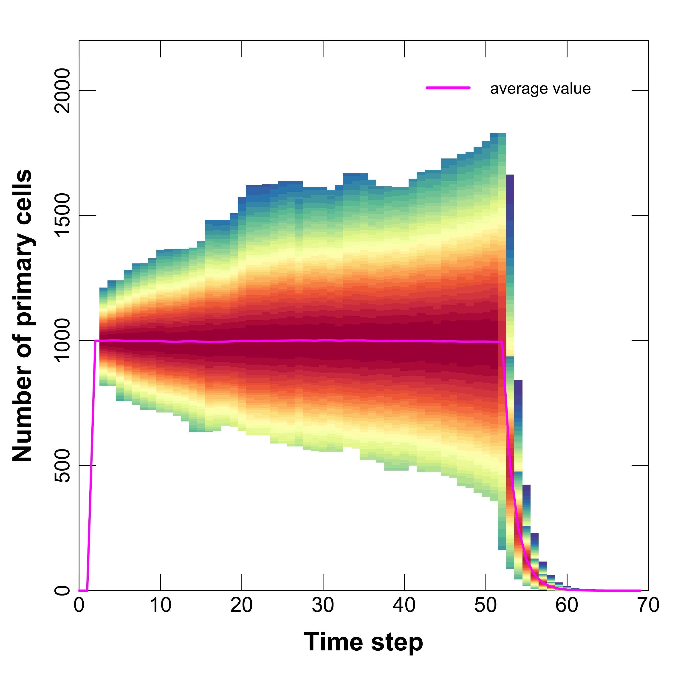
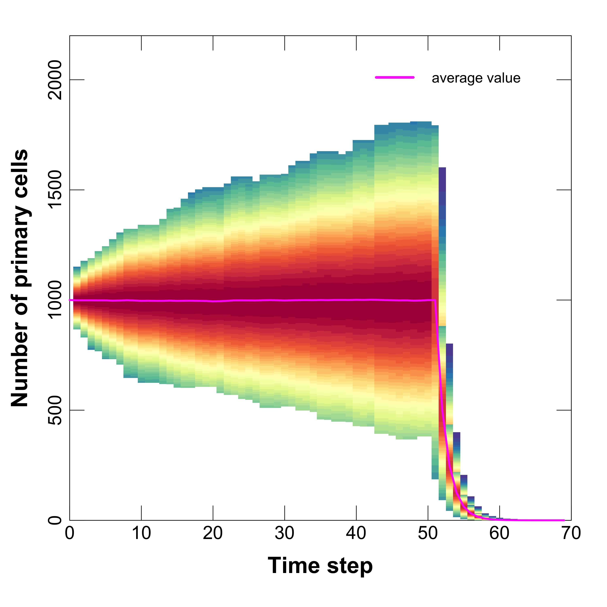
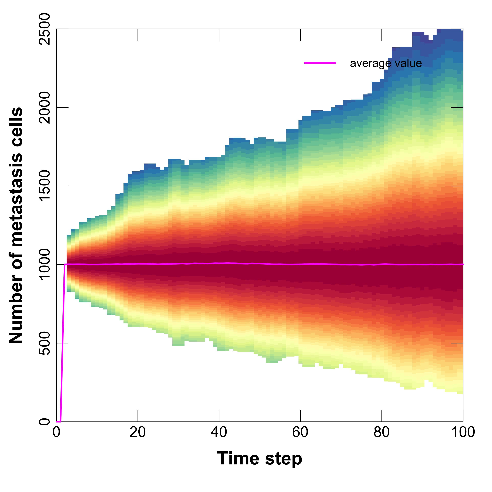
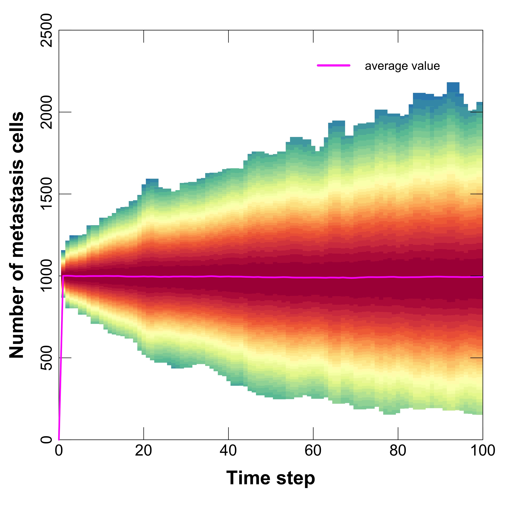
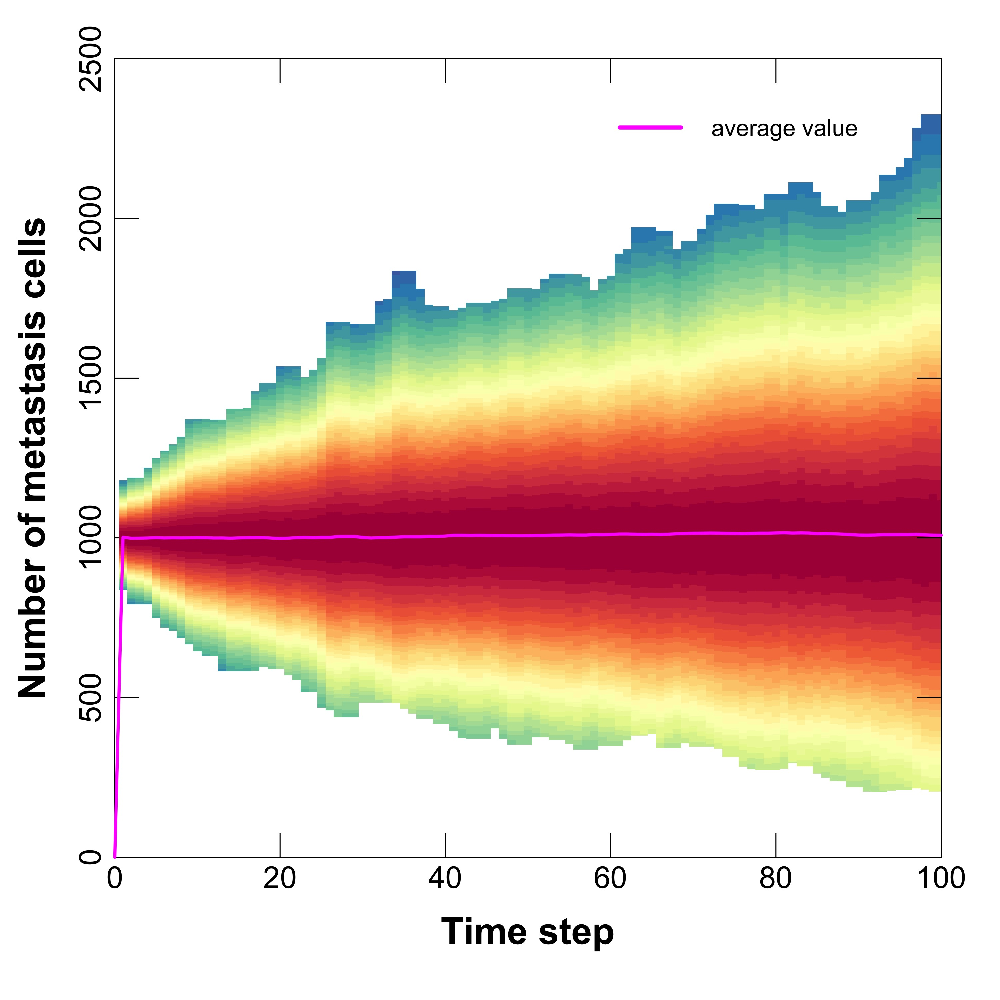
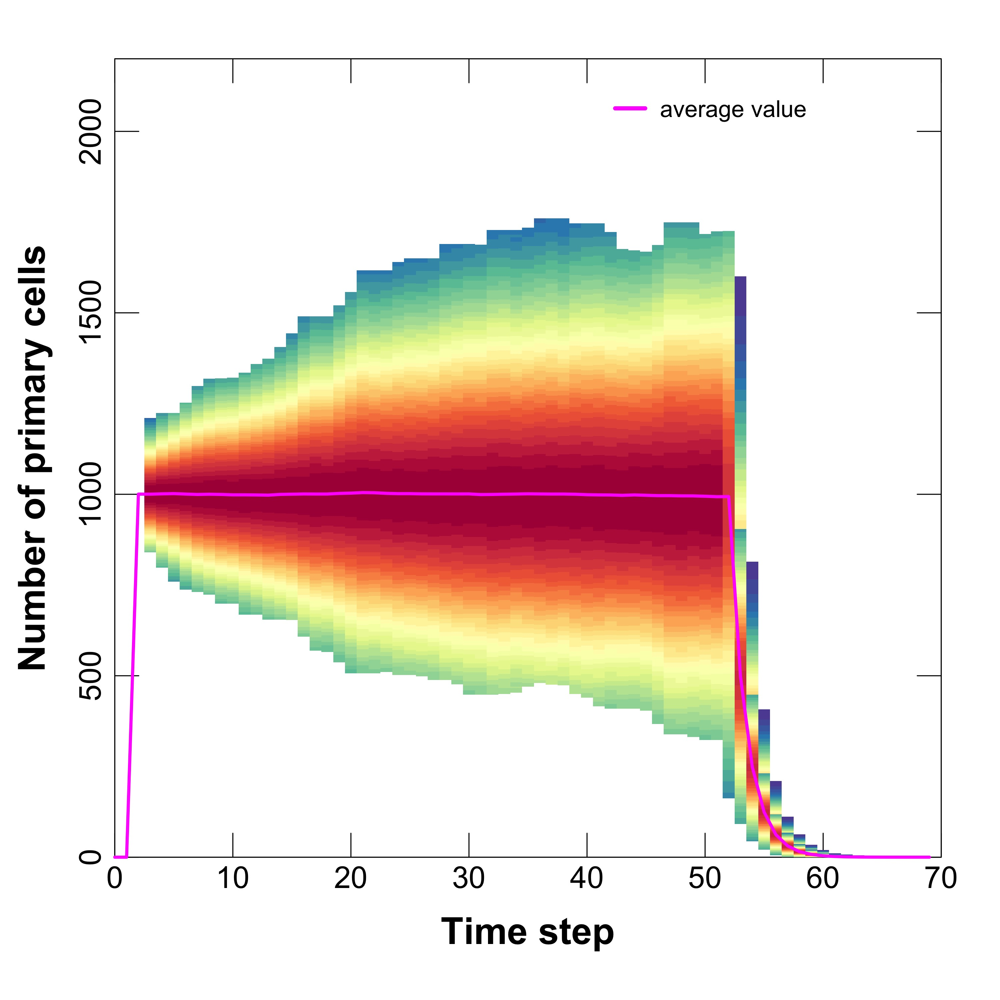
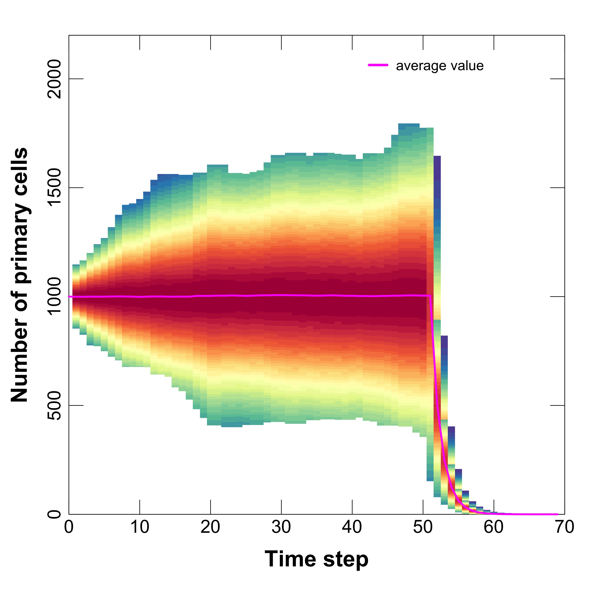

```{r setup, include = FALSE}
knitr::opts_chunk$set(
  fig.path='Figures/',
  echo=FALSE, 
  warning=FALSE, 
  message=FALSE,
  collapse = TRUE,
  comment = "#>"
)

Sys.setenv("TimeZone" = "Japan")
```

## Requirements

R version **3.6**

Libraries: **stringr, MASS, RColorBrewer, ape, ggplot2, ggtree, plyr** 

Operation systems: Window, Mac. The code for comparison is not tested under Linux based systems.

To perform the simulation, kindly see the **User-Guide-tugHall_v_2.0** file. 
To perform test's simulation, please, kindly see folder **/Results\_of\_tests/** and description in the file **User-Guide-Tests_v2.0**.
This document is only to explain a pricedure of comparison between cell-based and clone-based codes.
To reproduce plots with new data, please, kindly use file **REPORT.R** of an R script. 
To make animation of plots, please, kindly use **/GIF\_in\_R/GIF\_exmple.R** script. 

# Table of Contents
1. [Algorithm's differences](#new) 
2. [Distribution comparison](#distr)
3. [Environmental death](#env)
4. [Apoptosis death](#apoptosis)
5. [Invasion/metastasis transformation](#invasion)


<a name="new"></a>

# 1. Difference between cell-based and clone-based codes

## 1.1. Reason to develop clone-based code

* Clone-based code was designed to accelerate calculation and increase number of cell. 
Advantage of clone-based algorithm is making trial for all cells at 1 clone with one application of **trial()** function. In cell-based algorithm **trial()** apples to each cell. But if number of cells equal number of clones, then speed up is 1. That's why  clone-based code works faster for any cases. 

* Another reason is a case, when we need to simulate huge number of cells like $10^7$ or $10^9$, but mutation rate is very low. Cell-based algorithm takes a huge computational cost, and vice verse clone-based algorithm will work very fast, if mutated cells will appear slowly.

## 1.2. Usage of _trial()_ function

* In **trial()** function program apples several trials like enveronmental death, apoptosis death, division process, etc. We changed the trials with probability $p$ (for some death process) for each cell in the clone with for 1 trial with procedure:

$N_{cells} = N_{cells} - Binom(p,N_{cells})$,

where $Binom(p,N_{cells})$ is random generation for the binominal distribution, $N_{cells}$ is a number of cells in a clone. Probability $p$ is one of probability of death process, for example $p = a'$ or $p = k$ etc. 

* For cell division with probability $d'$ the new number of cells will be:

$N_{cells} = N_{cells} + Binom(d',N_{cells})$


* Check at the end of **trial()** function: if $N_{cells} = 0$, then the clone has died.


## 1.3. Usage of mutation function

* In mutation function we have changed the mutation to birth of a new clone (one mutation is a birth of one clone):

$N_{new\_clones} = Binom(m,N_{new\_cells})$,

$N_{new\_cells} = Binom(d',N_{cells})$.

* Passenger or Driver mutations do not matter for new clone's generation. Only during analysis, we will distinguish Passengers or Drivers clones.


## 1.4. Average function

* The average values $\overline{x}$ of probabilities or hallmarks are found by summation on the clones $x_i$ with multiplication by cells number $N_{cells,i}$ of this clone:

$\overline{x} = \frac{\sum_i x_i \cdot N_{cells,i} }{ \sum_i N_{cells,i}  }$,

where summation applies for all clones $i = 1 .. N_{clones}$. 

* For this purpose, we added the calculation of cells number (primary and metastasis) before average and hallmarks update.


<a name="distr"></a>

# 2. Distribution comparison

For comparison we used folder **/COMPARISON_CLONE_CELL/**. To exclude statistical error we repeated simulations for tests 1080 times, using cell-based and clone-based codes. The results of simulations in the folders **/RESULTS\_CELLS/** and **/RESULTS\_CLONES/** respectevly.  
To compare distributions of simulation data, here we use data of test for environmental death of metastasis cells.
Fig. 1 shows a comparison of the distributions of number of the metastasis cells during test simulations, repeated 100 times and acceleration rate clone-based calculation in comparison to cell-based one.
We expected acceleration rate around 1000, because of number of cells, but seemingly the averaging process or the memory allocation during parallel calculation takes more computational resources. That's why acceleration is around 10000 times. other words it is more than number of cells.
Data for clone-based code were obtained using personal computer with 1 processor and simulation time around 5-9 minuts. 
Data for  cell-based code were obtained using HPC supercomputer with 9 nodes with 24 cores for each (in total 216 processors), it takes around 4-6 hours.

Data give some discrepancy for 100 trials, but average values and width of distributions are almost same. 
To make sure that's due to statistical trials, we repeated simulations 1080 times and compare the accuracy for the clone-based and cell-based codes.


---

 

**Fig.1. Evolution of number of metastasis cells for 100 trials: left -** animation of distributions at different time steps (10,20,30,40,50,60,70,80,90), **right -** An acceleration rate for different tests: Ap\_Pr is apoptosis test for prymary cells, Ap\_Met is apoptosis test for metastasis cells, Env\_Pr is environment test for prymary cells, Env\_Met is environment test for metastasis cells, Met\_Tr is metastasis transformation test.

---

Fig. 2 shows a comparison of the distributions of number of the metastasis cells during test simulations, repeated 1080 times.
As we see, the statistical discrepancies for clone-based and cell-based codes are same. And statistical accuracy for 1000 trials is less than for 100 trials (Fig.1). 


---

 

**Fig.2. Distribution of number of metastasis cells for 1080 trials: left -** animation of distributions at different time steps (10,20,30,40,50,60,70,80,90) for clone-based and cell-based codes, **right -** same plot, but for only **cell-based** code and for different trials ($1 < trials<540$ and $540 < trials<1080$).

---


<a name="env"></a>

# 3. Environmental death

Fig. 3 shows results of 1080 trials of the environment test for primary cells using cell-based and clone based codes.
Fig. 4 shows same plots, but for metastasis cells. 
It's clear that results are same in the framework of statistical accuracy.

---

 

**Fig.3. Evolution of number of primary cells for 1080 trials: left -** data derived from cell-based code, **right -** data derived from clone-based code.

---

 

**Fig.4. Evolution of number of metastasis cells for 1080 trials: left -** data derived from cell-based code, **right -** data derived from clone-based code.

---


<a name="apoptosis"></a>

# 4. Apoptosis death 

Fig. 5 shows results of 1080 trials of the apoptosis test for primary cells using cell-based and clone based codes.
Fig. 6 shows same plots, but for metastasis cells. 
It's clear that results are same in the framework of statistical accuracy.


---

 

**Fig.5. Evolution of number of primary cells for 1080 trials: left -** data derived from cell-based code, **right -** data derived from clone-based code.

---

 

**Fig.6. Evolution of number of metastasis cells for 1080 trials: left -** data derived from cell-based code, **right -** data derived from clone-based code.

---


<a name="invasion"></a>

# 5. Invasion/metastasis transformation 


Fig. 7 shows results of 1080 trials of the test of the invasion/metastasis transformation for primary cells using cell-based and clone based codes.
It's clear that results are same in the framework of statistical accuracy.


---

 

**Fig.7. Evolution of number of primary cells for 1080 trials: left -** data derived from cell-based code, **right -** data derived from clone-based code.

---

