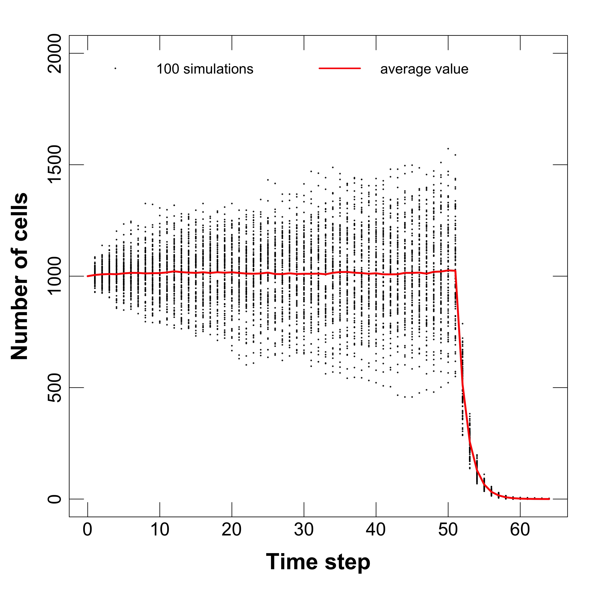
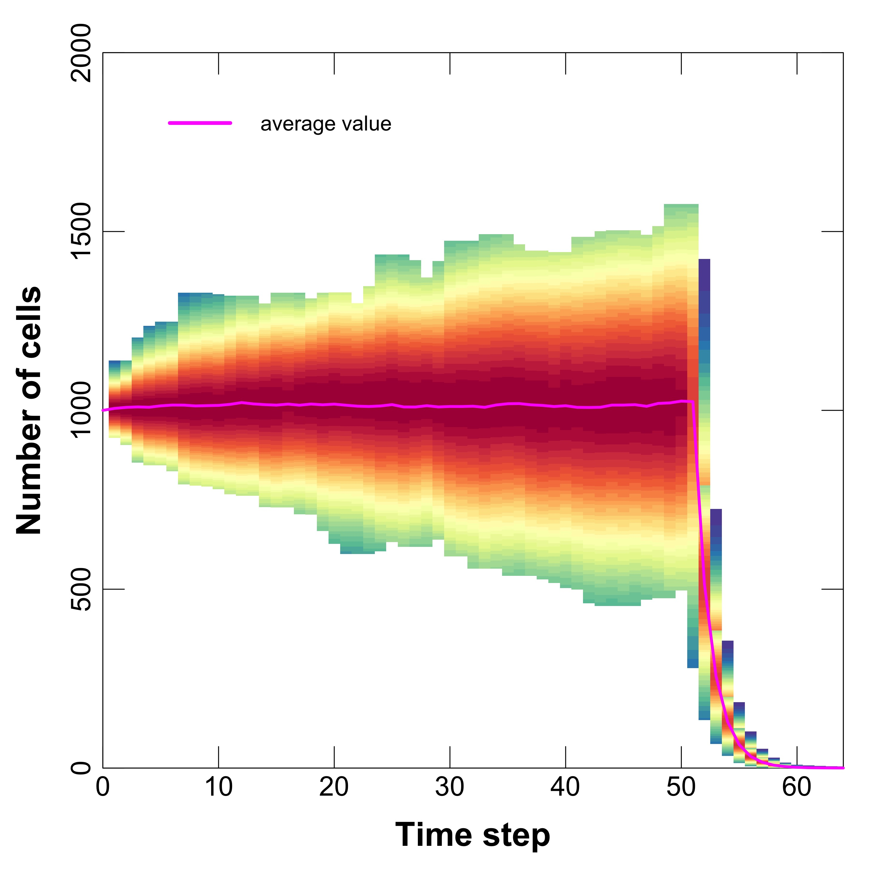
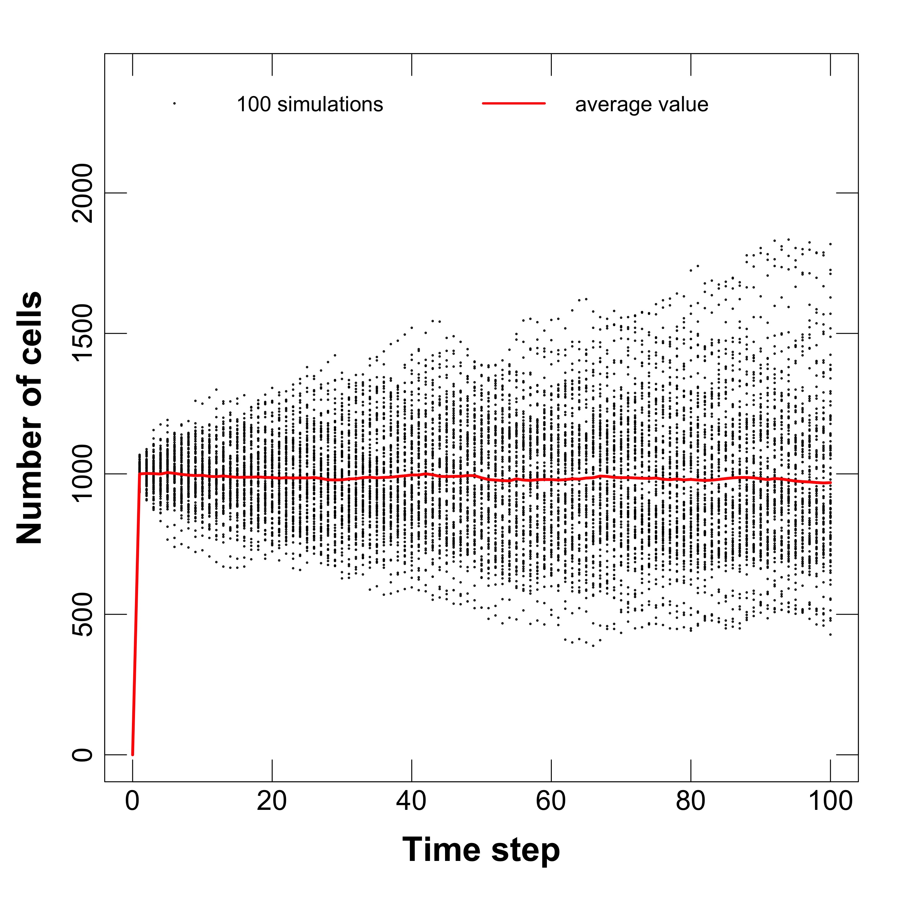
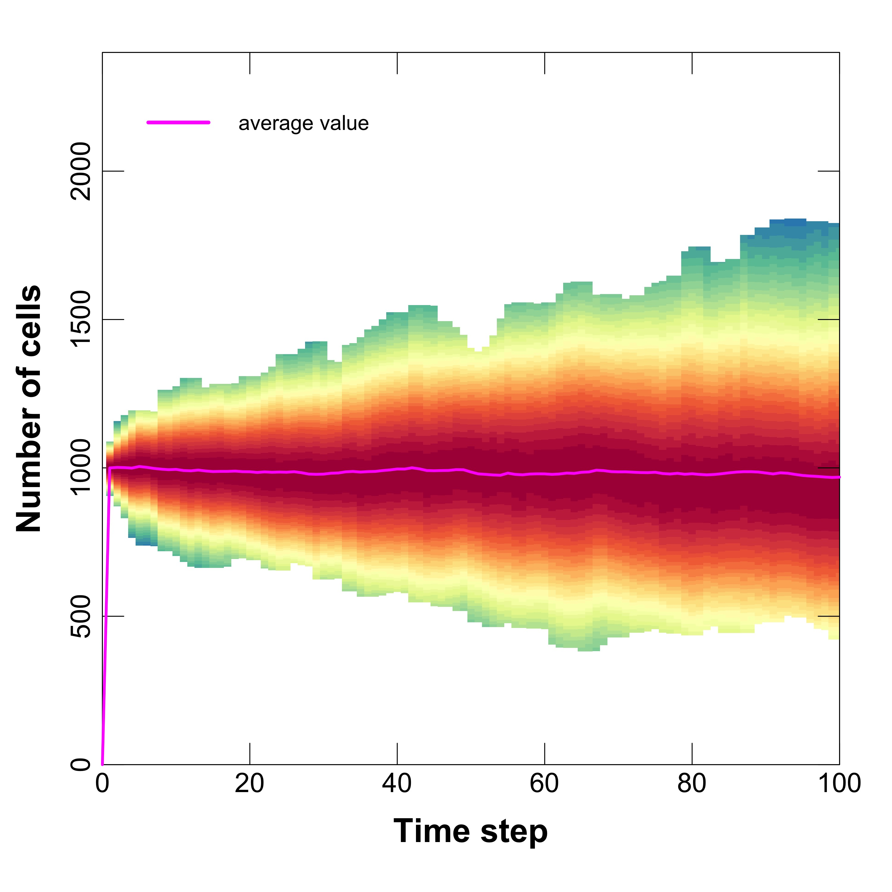
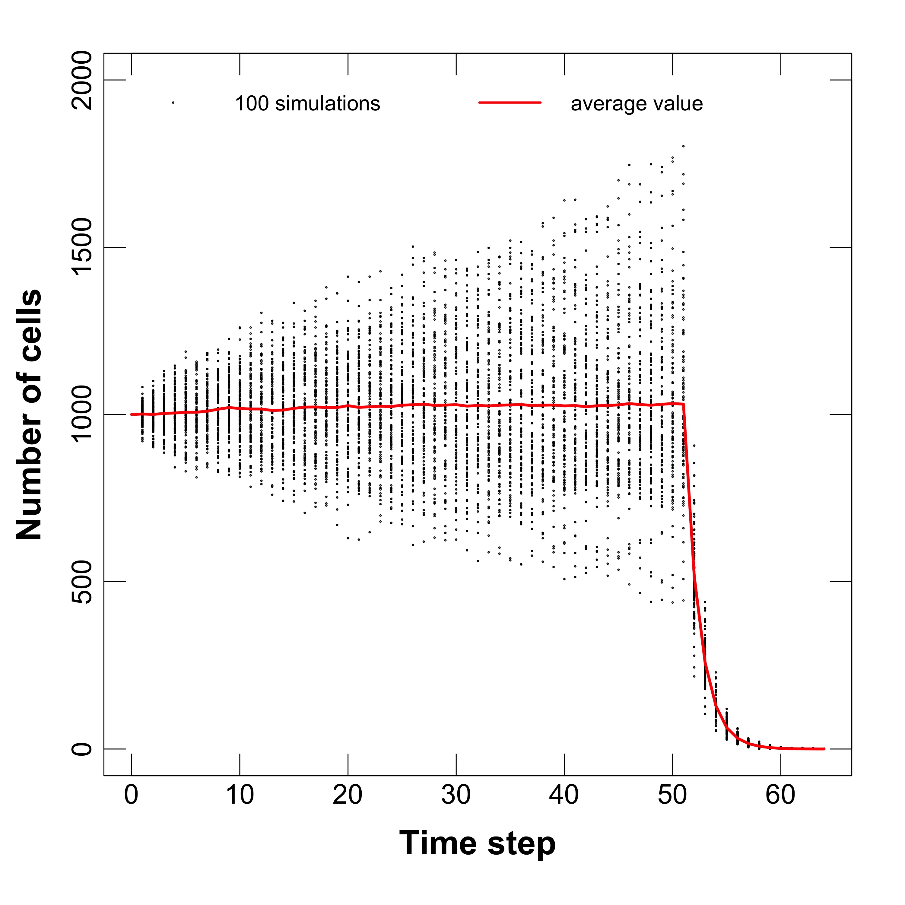
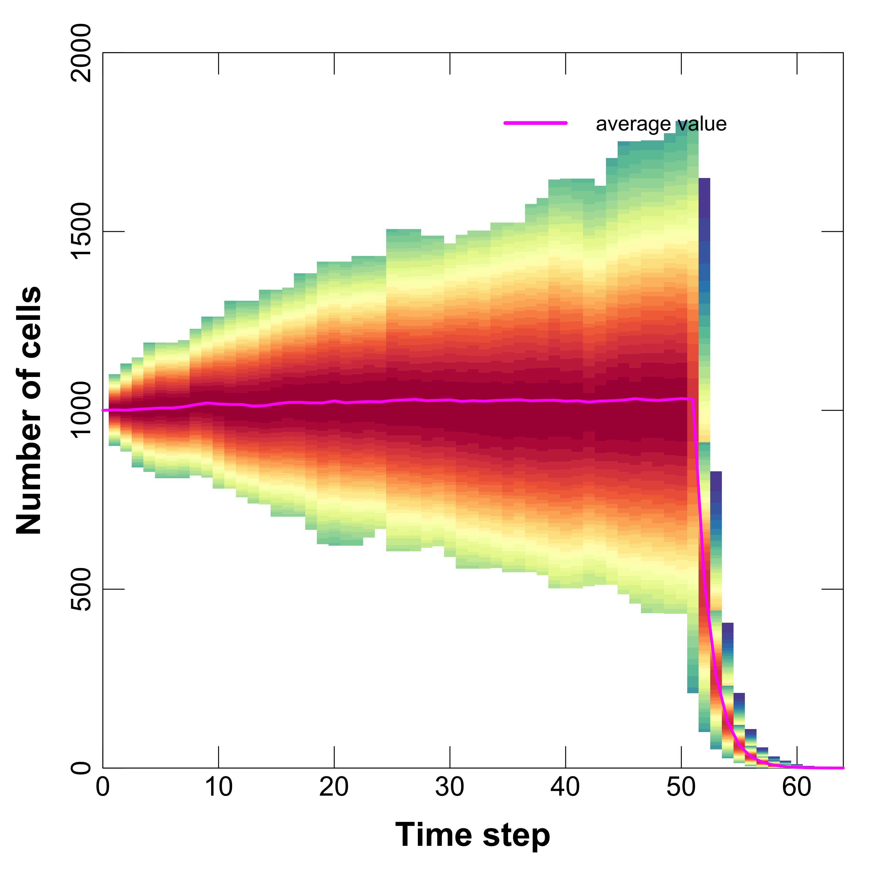
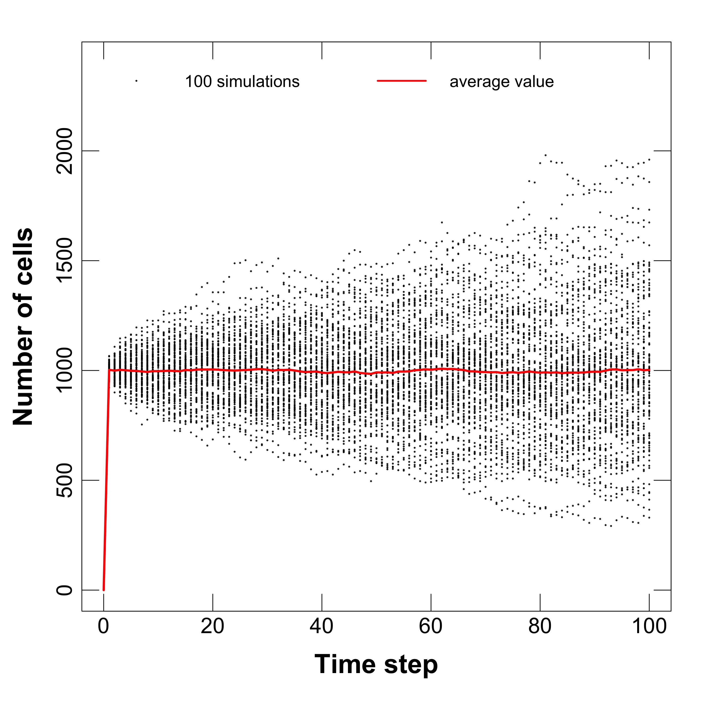
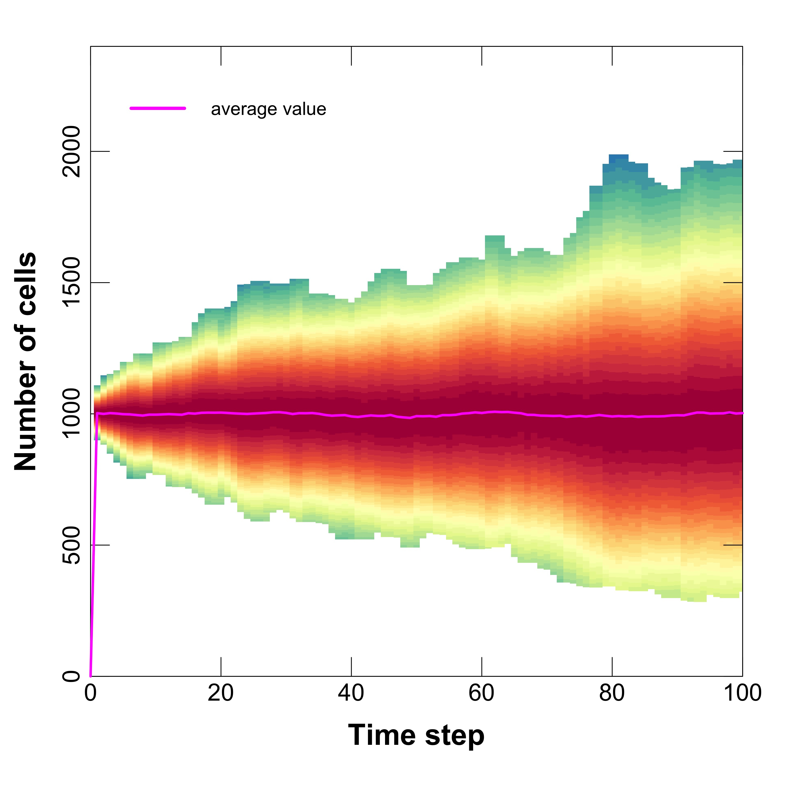
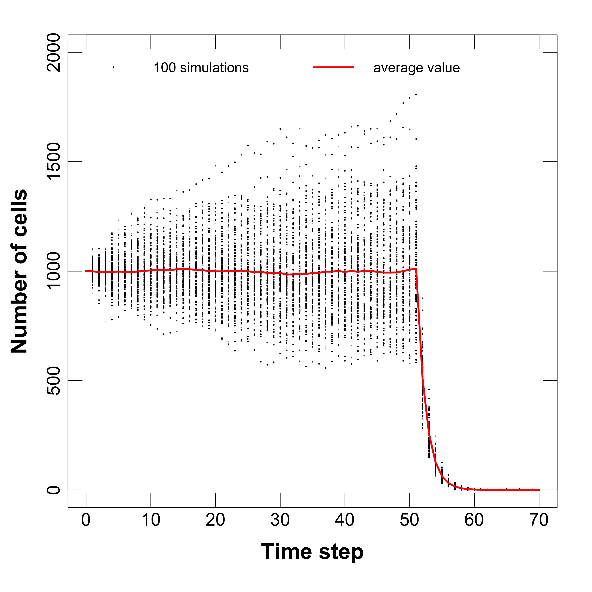
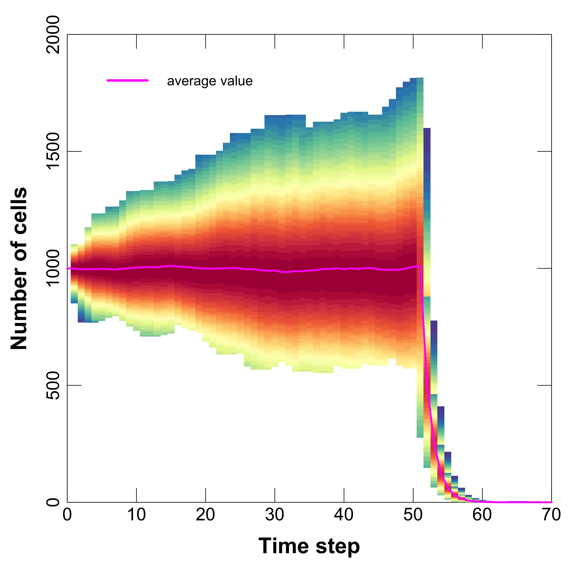

```{r setup, include = FALSE}
knitr::opts_chunk$set(
  fig.path='../Figures/',
  echo=FALSE, 
  warning=FALSE, 
  message=FALSE,
  collapse = TRUE,
  comment = "#>"
)

Sys.setenv("TimeZone" = "Japan")
```

## Requirements

R version **3.6**

Libraries: **stringr, actuar, MASS, RColorBrewer, ape, ggplot2, ggtree** 

Operation systems: Window, Mac. The code for analysis is not tested under Linux based systems.

To perform the simulation, kindly see the **User-Guide-tugHall_v_2.1** file. After the simulation the file **tugHall_2.1/Output/cloneout.txt** is generated, which is used to analyze the evolution of cells.

# Table of Contents
1. [Environmental death](#env)
2. [Apoptosis death](#apoptosis)
3. [Invasion/metastasis transformation](#invasion)
4. [Heyflick limit](#heyflick)
5. [Hallmarks tests](#halmarks)
6. [Tests for mutations](#mutation)

<a name="env"></a>

# 1. Environmental death

 For tests we use directory _Enveronmental\_death_:

- In the function **updateClone** of the class **hallmark** we have set **clone1$d = 1.0** to make devision for each time step.

- In the same function we have set **a = 0** to exclude apoptosis process.

- Set **k = 0.5** to check environmental death process.

Using these parameters, we should get constant number of cells in average. 
To check it, please, run the code and see results using **/Code/Average_tests.R** after finish of 100 trials for primary cells (Fig.1) and for metastasis cells (Fig.2). 

---

 

**Fig.1. Evolution of number of primary cells for 100 trials: left -** plot with dots, **right -** plot with distribution for each time step.

---

 

**Fig.2. Evolution of number of metastasis cells for 100 trials: left -** plot with dots, **right -** plot with distribution for each time step.

---


<a name="apoptosis"></a>

# 2. Apoptosis death 

For evolution tests we use directory _Apoptosis\_death_:

- In the function **updateClone** of the class **hallmark** we have set **clone1$d = 1.0** to make devision for each time step.

- In the same function we have set **a = 0.5** to **fix probability of apoptosis death**.

- Set **k = 0** to **exclude** the environmental death.

Using these parameters, we should get constant number of cells in average. 
To check it, please, run the code and see results using **/Code/Average_tests.R** after finish of 100 trials for primary cells (Fig.3) and for metastasis cells (Fig.4). 

---

 

**Fig.3. Evolution of number of primary cells for 100 trials: left -** plot with dots, **right -** plot with distribution for each time step.

---

 

**Fig.4. Evolution of number of metastasis cells for 100 trials: left -** plot with dots, **right -** plot with distribution for each time step.

---

The test for correct calculation of apoptosis probability is in the folder **Apoptosis\_function**. There is _cloninit.txt_ file in the **/Input** folder, which has initial clones with a different combination of mutated genes. 
Apoptosis probability defines by not negative function:

$a = \frac{1}{1+e^{- s  \cdot (x - 0.5)}} - H_a$, 

$a=0, ~~if~~a<0$

where $x$ is mutation density, $s$ is parameter. 


The file **/Output/clonout.txt** contents output data. There is no evolution, because in the **model** function we deleted this possibility. 
In the table below we can recalculate the mutation density and probability of apoptosis by hands (only data for first timestep are presented here):

---

**Table 1. Subset of output data.** The output data for all clones. The names of columns are related to the description in the  *USER-GUIDE-tugHall_v_2.1*.
```{r, echo=FALSE, results='asis'}
x <- read.csv(file = "Apoptosis_function/Output/cloneout.txt",header = TRUE, sep = "\t", nrows = 21)
x[is.na(x)] <- ""
x <- x[ , c(1,3,10,16,22)]
knitr::kable(x, align = "c", col.names = c("Time", "Index or Average", "$a$", "Apoptosis, $H_a$", "mutation density, $x$"), caption = "", format = "html", table.attr = "style='width:60%;'")
```

To check calculation it is needed to pay attantion only on the $a$, $H_a$ and **mutation density, $x$** columns.  
Also to check the calculation of the **mutation density, $x$** value, it is neccessary to see on the columns with driver genes in original file **Apoptosis_function/Output/cloneout.txt**. To see test "How hallmark apoptosis affects on $a$ - apoptosis probability", kindly see _Apoptosis_ subsection in section
[Hallmarks tests](#halmarks).


<a name="invasion"></a>

# 3. Invasion/metastasis transformation 


For evolution tests we use directory _Metastasis\_transformation_:

- In the function **updateClone** of the class **hallmark** we have set **clone1$d = 1.0** to make devision for each time step.

- In the same function we have set **a = 0** to **exclude the apoptosis death**.

- In the same function we have set **im = 0.5** to **fix probability of invasion/transformation**.

- Set **k = 0** to **exclude** the environmental death.

Using these parameters, we should get constant number of cells in average. 
To check it, please, run the code and see results using **/Code/Average_tests.R** after finish of 100 trials for primary cells (Fig.5). 
For metastasis cells we have got transformation if $im'=1$ that is easy to check by definition of all genes with mutations. 

---

 

**Fig.5. Evolution of number of primary cells for 100 trials: left -** plot with dots, **right -** plot with distribution for each time step.

---


<a name="heyflick"></a>

# 4. Heyflick limit 

Figures 1,3 and 5 show time evolution of number of primary cells. For primary cells, Heyflick limitations appears at 50 divisions.
Because of division occurs at each time step, we can see sharp decrease of number of cell after Heyflick limitation (50 steps). 
For metastasis cells, Figs.2 and 4 show there is no Heyflick limitation, because of hallmark affect.

--- 

<a name="halmarks"></a>

# 5. Hallmarks tests

The hallmarks tests based on idea: we have to check the influence only of hallmarks variables on probabilities. 
In this way it does not matter that happens with the clones and how the clones depend on probabilities. 
ONLY one process we want to check - how the probabilities depend on Hallmarks variables. 
What is why we changed the code TO STOP processes of division and death of cells/clones
(Please, kindly see **trial** function in the **Code/tugHall_2.1_functions.R** file).
Please, check the **FIRST** and **SECOND** time steps, because the invasion/metastasis transformation occurs only after trial!

To check the results of tests, we need just to open **Output/cloneout.txt** file and check values of hallmarks and related probabilities for each clone.
Here we can see the results of simlation for each hallmark variable separetly. 

## 5.1. Apoptosis $H_a$

There are only genes GA1, GA2, GA3 and GA4 related to the apoptosis hallmark (Table 2). Table 3 shows subset of outdata after simulation.
The apoptosis probability depends on apoptosis hallmark as a nonnegative linear function:
$a = \frac{1}{1+e^{- s  \cdot (x - 0.5)}} - H_a$. To check this dependence we applied high mutation density to all clones, so $a = 0.7310586$ for primary tumor clones and 
$a = 0.6224593$ for metastasis clones. Table 3 allows to check dependences of apoptosis hallmark $H_a$ on mutated genes $GA1, GA2, GA3, GA4$ as well as dependences of $a$ on $H_a$. Empty cell in Table 3 means 0, full cell means 1 in the dependence of hallmark: $H_a = \sum{w_i \cdot GA_i}$, full cell has information about the mutated site and toime step when mutation happend, but it does not matter for calculation of $a$ and $H_a$.  

---

**Table 2. Subset of gene's weights in definition of hallmarks 'Apoptosis'.** The names of columns are related to the description in the  *USER-GUIDE-tugHall_v_2.1*.
```{r, echo=FALSE, results='asis'}
x <- read.csv(file = "Hallmarks/Output/Weights.txt",header = TRUE, sep = "\t", nrows = 4)
x[is.na(x)] <- ""
## col.names = c("Genes", "Apoptosis, $H_a$", "Angiogenesis, $H_b$", "Growth / Anti-growth, $H_d$", "Immortalization, $H_i$", "Invasion / Metastasis, $H_{im}$")
 x <- x[,1:2]  # c(1:5,10,16:29)]
knitr::kable(x, col.names = c("Genes", "Apoptosis, $H_a$"), align = "c", caption = "", format = "html", table.attr = "style='width:30%;'") 
```

---

**Table 3. Subset of output data.** The output data for hallmark **Apoptosis**. The names of columns are related to the description in the  *USER-GUIDE-tugHall_v_2.1*.
```{r, echo=FALSE, results='asis'}
x <- read.csv(file = "Hallmarks/Output/cloneout.txt",header = TRUE, sep = "\t", nrows = 86)  
x[is.na(x)] <- ""
x <- x[c(1:10,44:53), ]
x <- x[ ,c(1,3,10,16,21:26)]
knitr::kable(x, align = "c", caption = "", format = "pandoc") 
```


## 5.2. Angiogenesis $H_b$

There are only genes GB1, GB2, GB3 and GB4 related to the angiogenesis hallmark (Table 4). Table 5 shows subset of outdata after simulation.
The division probability depends on angiogenesis hallmark as the function:

$d' = d - E' \cdot N$ for primary cells,

$d' = d$ for metastasis cells, 

where $N$ is a number of cells, $d = d_0 + H_d$. We define $H_d=1$ by all mutated genes $GD_i$ related to _growth/antigrowth_ $H_d$ hallmark. The $E'$ is a friction coefficient, which equals:

$E' = \frac{E_0}{1 + F_0 \cdot H_b}$ 

and $N_{max} = \frac{1}{E'}$ is a maximal number of primary cells, $F_0$ and $E_0$ are parameters defined by user, here $E_0= 10^{-3}, F_0 = 2$. 
To check these dependences we applied different mutated genes related to angiogenesis hallmark. Table 5 allows to check dependences of angiogenesis hallmark $H_b$ on mutated genes $GB1, GB2, GB3, GB4$ as well as dependences of $N_{max}$ and $E'$ on $H_b$. Empty cell with information of genes in Table 5 means 0, full cell means 1 in the dependence of hallmark: $H_b = \sum{w_i \cdot GB_i}$, full cell has information about the mutated site and time step when mutation happened, but it does not matter for calculation of $H_b$. Please, pay attantion that only for next time step we can check probabilities, because **trial** function is needed to change the state of cell to _metastasis_. That is why step 0 is skipped in the Table 5. 

---

**Table 4. Subset of gene's weights in definition of hallmarks 'Angiogenesis'.** The names of columns are related to the description in the  *USER-GUIDE-tugHall_v_2.1*.
```{r, echo=FALSE, results='asis'}
x <- read.csv(file = "Hallmarks/Output/Weights.txt",header = TRUE, sep = "\t", nrows = 8)
x[is.na(x)] <- ""
## col.names = c("Genes", "Apoptosis, $H_a$", "Angiogenesis, $H_b$", "Growth / Anti-growth, $H_d$", "Immortalization, $H_i$", "Invasion / Metastasis, $H_{im}$")
 x <- x[,c(1,3)]  
  x <- x[5:8, ]  # c(1:5,10,16:29)]
knitr::kable(x, col.names = c("Genes", "Angiogenesis, $H_b$"), align = "c", caption = "", format = "html", table.attr = "style='width:30%;'") 
```

---

**Table 5. Subset of output data.** The output data for hallmark **Angiogenesis**. The names of columns are related to the description in the  *USER-GUIDE-tugHall_v_2.1*.
```{r, echo=FALSE, results='asis'}
x <- read.csv(file = "Hallmarks/Output/cloneout.txt",header = TRUE, sep = "\t", nrows = 86)  
x[is.na(x)] <- ""
x <- x[c(55:62), ]
x <- x[ ,c(1,3,7,12:15,19:21,27:30)]
knitr::kable(x, align = "c", caption = "", format = "pandoc") 
```

--- 

## 5.3. Growth/antigrowth $H_d$

There are only genes GD1, GD2, GD3 and GD4 related to the Growth/antigrowth hallmark (Table 6). Table 7 shows subset of outdata after simulation.
The division probability depends on Growth/antigrowth hallmark as the linear function, restricted by 1:

$d = d_0 + H_d$,

$d=1$, if $d > 1$.

And again the 
$d' = d - E' \cdot N$ for primary cells,
and 
$d' = d$ for metastasis cells,
where $N$ is a number of cells, $d = d_0 + H_d$. We define $H_b=0$ and $E' = \frac{E_0}{1 + F_0 \cdot H_b} = 10^{-3}$ for all cells.

To check these dependences we applied different mutated genes related to Growth/antigrowth hallmark. Table 7 allows to check dependences of Growth/antigrowth hallmark $H_d$ on mutated genes $GD1, GBD, GD3, GD4$ as well as dependences of $d$ on $H_d$ for primary and metastasis cells. Empty cell with information of genes in Table 7 means 0, full cell means 1 in the dependence of hallmark: $H_d = \sum{w_i \cdot GD_i}$, full cell has information about the mutated site and time step when mutation happened, but it does not matter for calculation of $H_d$. Please, pay attantion that only for next time step we can check probabilities, because **trial** function is needed to change the state of cell to _metastasis_. That is why step 0 is skipped in the Table 7. 

---

**Table 6. Subset of gene's weights in definition of hallmarks 'Growth/antigrowth'.** The names of columns are related to the description in the  *USER-GUIDE-tugHall_v_2.1*.
```{r, echo=FALSE, results='asis'}
x <- read.csv(file = "Hallmarks/Output/Weights.txt",header = TRUE, sep = "\t", nrows = 20)
x[is.na(x)] <- ""
## col.names = c("Genes", "Apoptosis, $H_a$", "Angiogenesis, $H_b$", "Growth / Anti-growth, $H_d$", "Immortalization, $H_i$", "Invasion / Metastasis, $H_{im}$")
x <- x[,c(1,4)]  
x <- x[17:20, ]  # c(1:5,10,16:29)]
knitr::kable(x, col.names = c("Genes", "Growth/antigrowth, $H_d$"), align = "c", caption = "", format = "html", table.attr = "style='width:30%;'") 
```

---

**Table 7. Subset of output data.** The output data for hallmark **Growth/antigrowth**. The names of columns are related to the description in the  *USER-GUIDE-tugHall_v_2.1*.
```{r, echo=FALSE, results='asis'}
x <- read.csv(file = "Hallmarks/Output/cloneout.txt",header = TRUE, sep = "\t", nrows = 86)  
x[is.na(x)] <- ""
x <- x[c(77:86), ]
x <- x[ ,c(1,3,7,12:15,19:21,39:42)]
knitr::kable(x, align = "c", caption = "", format = "pandoc") 
```

---

## 5.4. Immortalization $H_i$

There are only genes GI1, GI2, GI3 and GI4 related to the Immortalization hallmark (Table 8). Table 9 shows subset of outdata after simulation.
The immortalization probability $i$ depends on immortalization hallmark $H_i$ as a nonnegative linear function:
$i' = 1 - H_i$. To check this dependence we applied different mutated rate for genes GI1, GI2, GI3 and GI4.

Table 9 allows to check the dependence for $H_i$ of immortalization hallmark on mutated genes $GI1, GI2, GI3, GI4$ as well as dependences of $i$ on $H_i$ for primary and metastasis cells. Empty cell in Table 9 means 0, full cell means 1 in the dependence of hallmark: $H_i = \sum{w_i \cdot GI_i}$, full cell has information about the mutated site and toime step when mutation happend, but it does not matter for calculation of $i$ and $H_i$.  

---

**Table 8. Subset of gene's weights in definition of hallmarks 'Immortalization'.** The names of columns are related to the description in the  *USER-GUIDE-tugHall_v_2.1*.
```{r, echo=FALSE, results='asis'}
x <- read.csv(file = "Hallmarks/Output/Weights.txt",header = TRUE, sep = "\t", nrows = 20)
x[is.na(x)] <- ""
## col.names = c("Genes", "Apoptosis, $H_a$", "Angiogenesis, $H_b$", "Growth / Anti-growth, $H_d$", "Immortalization, $H_i$", "Invasion / Metastasis, $H_{im}$")
x <- x[,c(1,5)]  
x <- x[13:16, ]  
knitr::kable(x, col.names = c("Genes", "Immortalization, $H_i$"), align = "c", caption = "", format = "html", table.attr = "style='width:30%;'") 
```

---

**Table 9. Subset of output data.** The output data for hallmark **Immortalization**. The names of columns are related to the description in the  *USER-GUIDE-tugHall_v_2.1*.
```{r, echo=FALSE, results='asis'}
x <- read.csv(file = "Hallmarks/Output/cloneout.txt",header = TRUE, sep = "\t", nrows = 86)  
x[is.na(x)] <- ""
x <- x[c(68:77), ]
x <- x[ ,c(1,3,8,18,21,35:38)]
knitr::kable(x, align = "c", caption = "", format = "pandoc") 
```

---


## 5.4. Invasion/metastasis $H_{im}$

There are only genes GIM1, GIM2, GIM3 and GIM4 related to the Invasion/metastasis hallmark (Table 10). Table 11 shows subset of outdata after simulation.
The invasion/metastasis probability $im'$ depends on invasion/metastasis hallmark $H_{im}$ as a linear function:

$im' = H_{im}$. 

To check this dependence we applied different mutated rate for genes GIM1, GIM2, GIM3 and GIM4.

Table 11 allows to check the dependence for $H_{im}$ of Invasion/metastasis hallmark on mutated genes $GIM1, GIM2, GIM3, GIM4$ as well as dependences of $im'$ on $H_{im}$ for primary and metastasis cells. Empty cell in Table 11 means 0, full cell means 1 in the dependence of hallmark: $H_{im} = \sum{w_i \cdot GIM_i}$, full cell has information about the mutated site and toime step when mutation happend, but it does not matter for calculation of $im'$ and $H_{im}$.  
Please, pay attantion that only for next time step we can check status of cells, because **trial** function is needed to change the state of cell to _metastasis_.
The status dependes on $im'$ probability, if $im' = 1$ then $type= 1~~or~~'metastasis'$, for other cases $type =0~~or~~'primary'$.

---

**Table 10. Subset of gene's weights in definition of hallmarks 'Invasion/metastasis'.** The names of columns are related to the description in the  *USER-GUIDE-tugHall_v_2.1*.
```{r, echo=FALSE, results='asis'}
x <- read.csv(file = "Hallmarks/Output/Weights.txt",header = TRUE, sep = "\t", nrows = 20)
x[is.na(x)] <- ""
## col.names = c("Genes", "Apoptosis, $H_a$", "Angiogenesis, $H_b$", "Growth / Anti-growth, $H_d$", "Immortalization, $H_i$", "Invasion / Metastasis, $H_{im}$")
x <- x[,c(1,6)]  
x <- x[9:12, ]  
knitr::kable(x, col.names = c("Genes", "Invasion / Metastasis, $H_{im}$"), align = "c", caption = "", format = "html", table.attr = "style='width:30%;'") 
```

---

**Table 11. Subset of output data.** The output data for hallmark **Invasion/metastasis**. The names of columns are related to the description in the  *USER-GUIDE-tugHall_v_2.1*.
```{r, echo=FALSE, results='asis'}
x <- read.csv(file = "Hallmarks/Output/cloneout.txt",header = TRUE, sep = "\t", nrows = 86)  
x[is.na(x)] <- ""
x <- x[c(20:24,63:67), ]
x <- x[ ,c(1,3,9,17,21,31:34)]
knitr::kable(x, align = "c", caption = "", format = "pandoc") 
```


---

<a name="mutation"></a>

# 6. Tests for mutations

In this tests, we check the only **mutation** process and how it affects on hallmark variables. 
So, the normal reaction for test is the random changes in the genes with formula:

$m'=m_0 \cdot l_{CDS},$

where $m_0$ is the initial rate of mutation defined by user, $l_{CDS}$ is the CDS length of a gene.
If a gene is changed then the related hallmark also has to be changed.
The mutation process depends on several parameters: $m_0, u_s, u_o$ and the CDS lengths of the genes. 
the variables $m_0, u_s, u_o$ are defined by user, the CDS lengths of the genes are defined in the **Gene_cds2** files (Table 12). 
The  parameters $u_s, u_o$ define the mutatopn processes in the suppressors and oncogenes respectively. 
Mutation of driver genes depends on probabilities $u_s$ and $u_o$.
Mutation of passenger genes depends on probabilities $(1- u_s)$ and $(1 - u_o)$ without changes in the hallmarks variables.

Mutation occurs only during division process, so the mutation must occur for parents and daughter cells independently. FOR TEST we changed the code and **switch off** the death of cell in order to check the mutation process.
The *cloneinit.txt* file is permanent for all tests (Table 13), 
it has the cells with all combinations of 4 genes + GD. The GD gene is needed, because the mutation occurs **ONLY** during the division process, 
that is why we need GD (GD switch on the division process with the probability 1).

In this tests we change only the **Gene_cds2** and $u_s, u_o, m_0$ to check the calculations of hallmarks variables.
The results of simulations are in Table 14.

---

**Table 12. Gene_cds_2 files: Different files for test simulations.** (The names of columns are related to the description in the  *USER-GUIDE-tugHall_v_2.1*).


---

```{r, echo=FALSE, results='asis'}
x <- read.csv(file = "Mutation/Input/gene_cds2_o.txt",header = FALSE, sep = "\t")  
x[is.na(x)] <- ""
y <- read.csv(file = "Mutation/Input/gene_cds2_s.txt",header = FALSE, sep = "\t")  
y[is.na(y)] <- ""
names(x) <- c("Gene","Length of CDS", "Hallmark", "o/s","Weight")
names(y) <- names(x)
#x <- x[c(20:24,63:67), ]
#x <- x[ ,c(1,3,9,17,21,31:34)]
knitr::kable(list(x,y), align = "c", caption = "**Table 12. A)** Files for oncogenes (**gene_cds2_o.txt** - left) and supressors (**gene_cds2_s.txt** - right).", format = "html", table.attr = "style='width:90%;'") 
```


```{r, echo=FALSE, results='asis'}
x <- read.csv(file = "Mutation/Input/gene_cds2_o_100.txt",header = FALSE, sep = "\t")  
x[is.na(x)] <- ""
y <- read.csv(file = "Mutation/Input/gene_cds2_s_100.txt",header = FALSE, sep = "\t")  
y[is.na(y)] <- ""
names(x) <- c("Gene","Length of CDS", "Hallmark", "o/s","Weight")
names(y) <- names(x)
#x <- x[c(20:24,63:67), ]
#x <- x[ ,c(1,3,9,17,21,31:34)]
knitr::kable(list(x,y), align = "c", caption = "**Table 12. B)** Files for oncogenes (**gene_cds2_o_100.txt** - left) and supressors (**gene_cds2_s_100.txt** - right).", format = "html", table.attr = "style='width:90%;'") 
```


```{r, echo=FALSE, results='asis'}
x <- read.csv(file = "Mutation/Input/gene_cds2_o_1000_1.txt",header = FALSE, sep = "\t")  
x[is.na(x)] <- ""
y <- read.csv(file = "Mutation/Input/gene_cds2_s_1000_1.txt",header = FALSE, sep = "\t")  
y[is.na(y)] <- ""
names(x) <- c("Gene","Length of CDS", "Hallmark", "o/s","Weight")
names(y) <- names(x)
#x <- x[c(20:24,63:67), ]
#x <- x[ ,c(1,3,9,17,21,31:34)]
knitr::kable(list(x,y), align = "c", caption = "**Table 12. C)** Files for oncogenes (**gene_cds2_o_1000_1.txt** - left) and supressors (**gene_cds2_s_1000_1.txt** - right).", format = "html", table.attr = "style='width:90%;'")
```


```{r, echo=FALSE, results='asis'}
x <- read.csv(file = "Mutation/Input/cloneinit.txt",header = FALSE, sep = "\t")  
x[is.na(x)] <- ""
names(x) <- c("ID","Mutated genes", "Number of cells")
knitr::kable(x, align = "c", caption = "**Table 13.** Input file **cloneinit.txt** with initial clones, which have mutated genes", format = "pandoc")
```

---

```{r, echo=FALSE, results='asis'}
x <- read.csv(file = "Mutation/Results.txt",header = TRUE, sep = "\t")  
x[is.na(x)] <- ""
 names(x) <- c("Genefile",	"$u_s$", "$u_o$", "$m_0$",	"Results",	"Conclusion") 
knitr::kable(x, align = "c", caption = "**Table 14.** Results of test's simulations from the file **Results.txt**", format = "pandoc")
```


